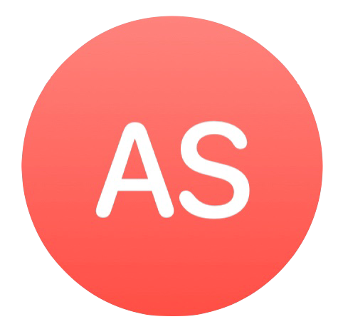

Hi there! 👋😊 I’m Aled and I’m an iOS Developer who has been playing with Apple devices for over a decade, and now lives in London (originally from Wales 🏴󠁧󠁢󠁷󠁬󠁳󠁿). I've worked with iOS (/iPhone OS), iPadOS, watchOS, and much much more.

## 🐙 Personal

Health is absolutely going to blow up over the next decade and it’s something I am incredibly passionate about and most of my personal projects use HealthKit such as "and Chill" and ["Autooth"](https://testflight.apple.com/join/da8mRQpG). Keep an eye on my [Twitter](https://twitter.com/samuelaled/) for updates on what’s new in the iOS Health world!

## ✈️  Aviation

I currently work at [Evoke Systems Ltd](https://www.evoke-systems.aero) where pilots and the rest of the crew depend on our work for smooth flights (if you ever get delayed don't come knocking on my door please!), and the professional attitude to the work is unrivalled. Whereas most of my other work has been agency-style, it's really refreshing to work on a singular product with full responsibility and accountability set to a high standard. Hoping to eventually fully lead the mobile team and become an Engineering Manager in the near future!

## 🧠 Mental Health

During the COVID-19 pandemic I spent a short stint working on an iOS wellbeing app at [People Matter.](https://www.peoplematter.tech) Working with some incredibly knowledgeable people on the topic was such an amazing opportunity and I've learned so much not only about the wellbeing of others but my own.

## ⚽️ Sports

I spent over 5 years working at [Other Media](https://other.media) who is top of their game in sport tech and I’ve helped bring many big names come to digital life. 

## 📚 Educational

Being Welsh is a big thing for me, and I’m proud to have made some of the most popular Welsh iOS apps ever, and the first Welsh Apple Watch app! To have reached over 100,000 Welsh speaking children is 💯  (it was quite the challenge being the sole developer at Big Click 😳 and even trying my hand at writing Android apps).

## 👥 Community

I like to share my thoughts on [Twitter](https://twitter.com/samuelaled/) mostly though I'm looking forward to doing another talk sometime like my one at NSLondon about the new Dark Mode support in iOS 13.

## 🗣 Social

🐦 [Twitter](https://twitter.com/samuelaled/)

👔 [LinkedIn](https://uk.linkedin.com/in/aled-samuel-b7ba3424)

3️⃣ [aleds.eth](https://aleds.eth.xyz)

<!--### Hi there 👋-->

<!--
**SunburstEnzo/SunburstEnzo** is a ✨ _special_ ✨ repository because its `README.md` (this file) appears on your GitHub profile.

Here are some ideas to get you started:

- 🔭 I’m currently working on ...
- 🌱 I’m currently learning ...
- 👯 I’m looking to collaborate on ...
- 🤔 I’m looking for help with ...
- 💬 Ask me about ...
- 📫 How to reach me: ...
- 😄 Pronouns: ...
- ⚡ Fun fact: ...
-->
